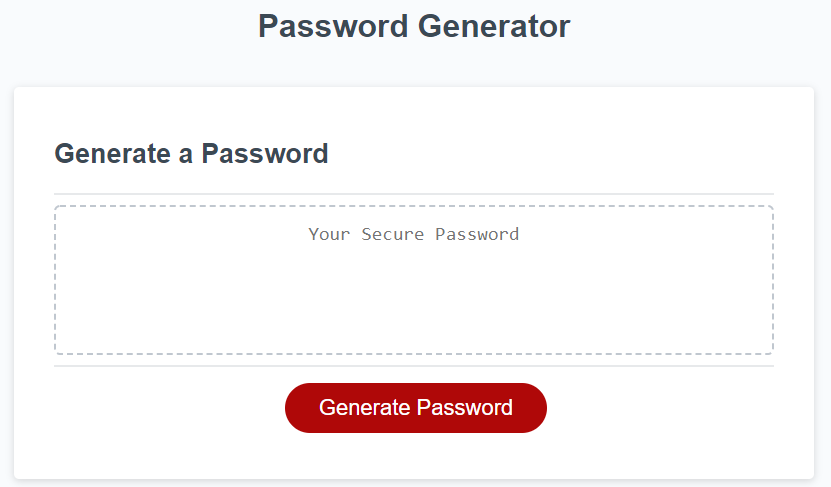
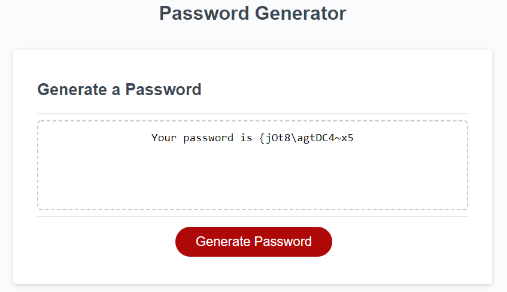

# Password Generator
## Description
The goal of this project was to create a random password generator. The length and format of the password would be dependent upon user input.

The index.html and style.css files were provided for this project. A portion of starter code for the script.jss file was also provided. 

## Acceptance Criteria
1. Users have a button that intitates the creation of a new, random password.
2. The application will prompt the user for the necessary length of their password.
3. Password must be between 8 and 128 characters. 
4. Users may choose an option of password characteristics, including lowercase letters, uppercase letters, numbers, and special characters.
5. Once all selections have been made, the application displays the user's new password. 

## Solution
An event listener was created for the application's "Generator Password" button that iniates the functions associated with this page. 

The initial prompt asks the user to choose a password length. If the user chooses a number that does not fall within the range of 8-128, they are prompted to enter a new length. 

Subsequent prompts ask the user to confirm whether their password should include lowercase letters, uppercase letters, numbers, and special characters. A JavaScript variable was created for password criteria. Initially, this variable contains an empty string, but as the user confirms criteria, characters are added to the string. (For testing purposes, the string containing all possible password characters is logged to the console after each user input.)

Once the string is complete, a for loop is used to generate a set of random numbers equal to the user's chosen password length. Each number is then used as an index to choose a password character from the password criteria string.

**Example of FOR Loop:** 

    for (var i = 0; i < pwlength; i++) {
    var max = (pwdcriteria.length);
    var min = 0;
    var char = (Math.floor(Math.random() * (max - min)) + min);
    password = password + pwdcriteria[char];
  }

When the password is complete, it is passed to the designated text area (using the element's ID) within the index.html file. Some additional text was included in this area to indicate the collection of characters is the user's new password. 

## Location
Use the following link to access the repository associated with this project: [Password Generator Repository](https://github.com/larrygjenkins/PasswordGenerator.git)

Use the following link to access the Password Generator application: [Password Generator Application](https://larrygjenkins.github.io/PasswordGenerator/)

## Example Images
Following is an image of the password generator before a new password is created:

Following is an image of the password generator after a new password is created:

